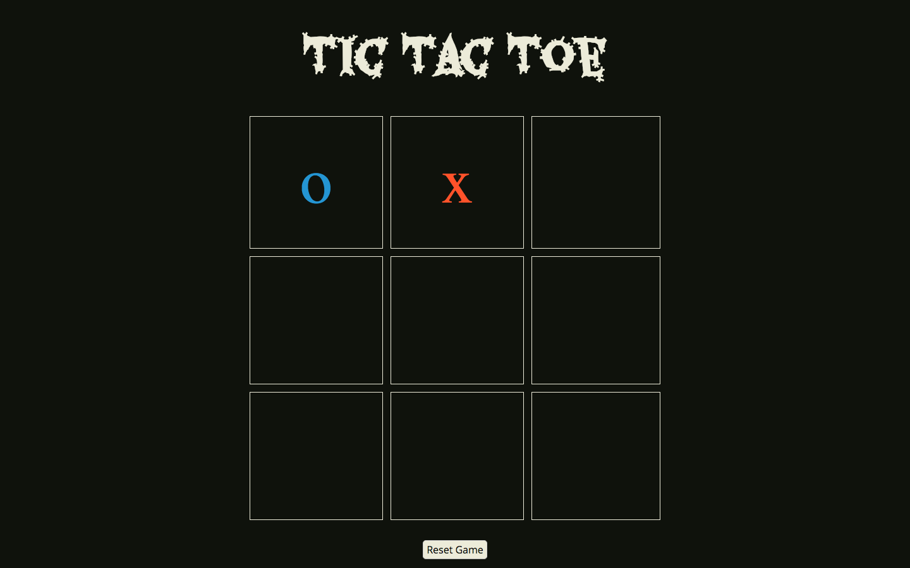

# Project_0
----------------

## Tic Tac Toe
-------------

#### About the project
-----------------------

Project developed during GA immersive course.
A basic Tic-Tac-Toe for one player using basic `html`
`Sass` `jQuery` and `Javascript`.

[Live GitHub Page here](https://misaelmp.github.io/tic_tac_toe/index.html)

#### Screenshots

#### Programming languages used

- html
- Sass
- Css
- Javascript
- jQuery

#### How to use?

Just click the bloody cell, I am sure you have play this before , otherwise refer to this [Tic-Tac-Toe](https://en.wikipedia.org/wiki/Tic-tac-toe).

#### Contribution
Feel free to leave any comment or advice.
#### Credits
Thanks to the team at GA Sydney WDI28, to Joel, John & Classmates.

#### Licence

__Open Source__
